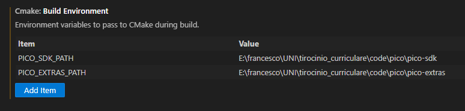
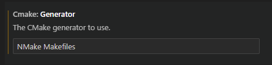
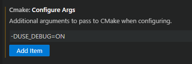

# SALS
Enable LoRaWAN communications on your [Raspberry Pi Pico](https://www.raspberrypi.org/products/raspberry-pi-pico/) or any RP2040 based board using a [Semtech SX1262 radio module](https://www.semtech.com/products/wireless-rf/lora-connect/sx1262).

Based on the Semtech's [LoRaWAN end-device stack implementation and example projects](https://github.com/Lora-net/LoRaMac-node) with a slight [edit](https://github.com/Prop4et/LoRaMac-node.git) to force the node on a single frequency with a SF12BW125 to communicate with a nanogateway.

The Raspberry Pi Pico is connected to a [Bosch BME688](https://www.bosch-sensortec.com/products/environmental-sensors/gas-sensors/bme688/) sensor that reads temperature, atmospherical pressure, humidity and air quality measured in Ohm. 

The project also includes the [little-fs library](https://github.com/lurk101/littlefs-lib/tree/4364b3ac5e91a0be8b6f6138318f4e47fda4a6a7) to use the filesystem on the pico that is used to save the state file for the BME688

## How to run
First of all is adviced to download the project through git clone, that allows for downloading the submodule:
```
git clone https://github.com/Prop4et/SALS.git --recurse-submodule 
```
Once the repository is cloned there are a few steps needed to set up the environment to compile the code.
Firstly the environment for the Raspberry Pi Pico needs to be created, here are reported the main steps used to set up the environment through **CMake** and **Visual Studio Code** on windows. On linux based operating systems the steps are the same without the need to install the nmake generator since it should be already set up. For a more in depth set up guide follow the [official website documentation](https://www.raspberrypi.com/documentation/pico-sdk/index_doxygen.html)

### Environment set up on Windows with VSC
* To set up the environment on windows the first step is to download, through the [Visual Studio page](https://visualstudio.microsoft.com/it/) the required software tools (C++ tools). After the installation open the installed developer command prompt and open VSC using the **code** command and then install the CMake tools extension.

* To configure the environment in CMake:
  + download the **Pico SDK** from [github](https://github.com/raspberrypi/pico-sdk.git)
  + download the **Pico extras** from [github](https://github.com/raspberrypi/pico-extras.git)
  + download the **gcc compiler** for the arm processor [here](https://developer.arm.com/downloads/-/gnu-rm)
  + In the CMake tools exstension settings configure the path for the SDKs, adding the path to the SDK to the build environment 
  
  
  + Then set the cmake generator to the NMake Makefiles
  
  

  + Finally in the configure args a new compile arguments needs to be created, this argument lets the program print out debug information when set to on, if it is set to off it will avoid most of the prints and the initialization of the output libraries and irqs for the pico

  

After the set up of the CMake environment there are a couple of files that aren't included for Copyright or Security reasons that need to be created or downloaded:
* to use the class-a or class-c example the lora-config.h needs to be created inside the folder of the project [class-a](./executables/class-a/), [class-c](./executables/class-c/). This file should follow the format shown in [config.h](./executables/class-a/config.h) where the id for the device is defined, and then the 3 parameters used in the LoRaWAN ABP activation protocol are defined.

* from the BOSCH website download the [bsec](https://www.bosch-sensortec.com/software-tools/software/bsec/) library if it isn't already present in the system. The default configuration of the project uses the latest release available at the moment of the creation of this document, which is the 2.4 version. Once it is downloaded the header files and the compiled library file should be copied inside the [bsec2_4](./executables/lib/bme/bsec2_4/) folder. The files needed are *bsec_datatypes.h*, *bsec_interface.h*, *bsec_interface_multi.h* and *libalgobsec.a*. These files are inside the normal_version folder and the bin folder of the downloaded archive. The binary version should be the one for the Cortex_M0+ processor (the pico one) compiled with gcc.

Finally, before building a project, there are a couple of operations needed to set up the last CMake options. On the  the CMake options should be in release mode (the debug mode sets random parameters for LoRa), with the gcc-arm-none-eabi compiler selected and, my personal advice, the desired project for the build selected. This will avoid the compilation of the whole executables folder, speeding up the process of compilation since the NMake doesn't support multithread compilation. 

The last bit of advice in case of incomplete configuration is to check the problems tab and check for missing files/generator. In case of failed compilation check for errors in the code and, if something changed in the libraries, delete/clean the build directory to create a fresh compile process making sure that every file is compiled again.

## Hardware

 * RP2040 board
   * [Raspberry Pi Pico](https://www.raspberrypi.org/products/raspberry-pi-pico/)
 * Semtech SX1262 board
   * [Waveshare EU868 LoRa Hat](https://www.waveshare.com/pico-lora-sx1262-868m.htm)
 * Bosch BME688
   * [Adafruit BME688](https://www.adafruit.com/product/5046) 

### Default Pinout

| Raspberry Pi Pico / RP2040 | Semtech SX1262 |
| ----------------- | -------------- |
| 3.3V | VCC |
| GND | GND |
| GPIO 10 | SCK |
| GPIO 11 | MOSI |
| GPIO 12 | MISO |
| GPIO 3 | NSS / CS |
| GPIO 15 | RESET |
| GPIO 2 | BUSY
| GPIO 20 | DIO1 / G1 |

| Raspberry Pi Pico / Waveshare SX1262 | Adafruit BME688 |
| ----------------- | -------------- |
| 3.3V | VCC |
| GND | GND | 
| GND | SDO |
| GPIO 8 | SDA / SDI |
| GPIO 9 | SCL / SCK |

| Raspberry Pi Pico / Waveshare SX1262 | little-fs |
| ----------------- | -------------- |
| GPIO 17 | GND / non formatting filesystem| 
| GPIO 17 | GPIO 16 / formatting filesystem|
The first time the Raspberry Pi Pico is switched on it should be GPIO 17 - GPIO 16

| Raspberry Pi Pico / Waveshare SX1262 | Adafruit SD breakout |
| ----------------- | -------------- |
| 3.3v | 3v | 
| GND | GND |
| GPIO 4 | DO |
| GPIO 5 | CS |
| GPIO 6 | CLK |
| GPIO 7 | DI |


